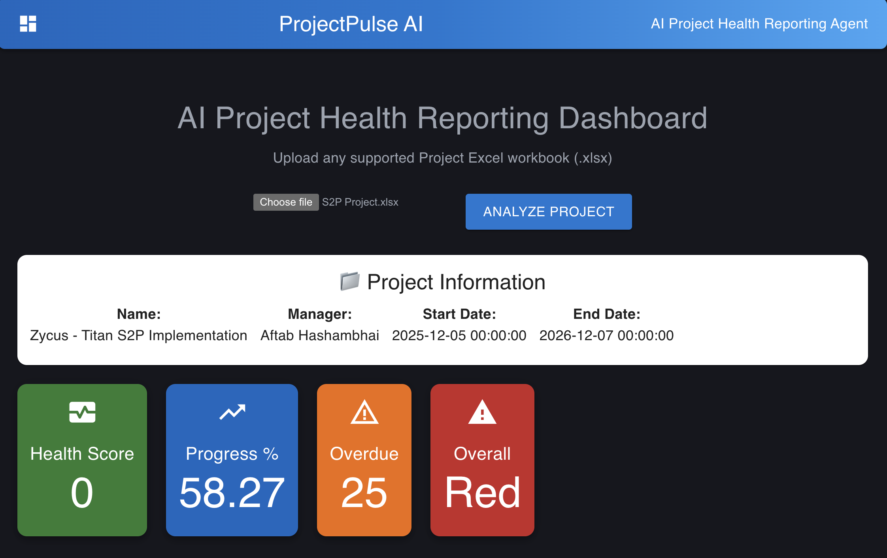
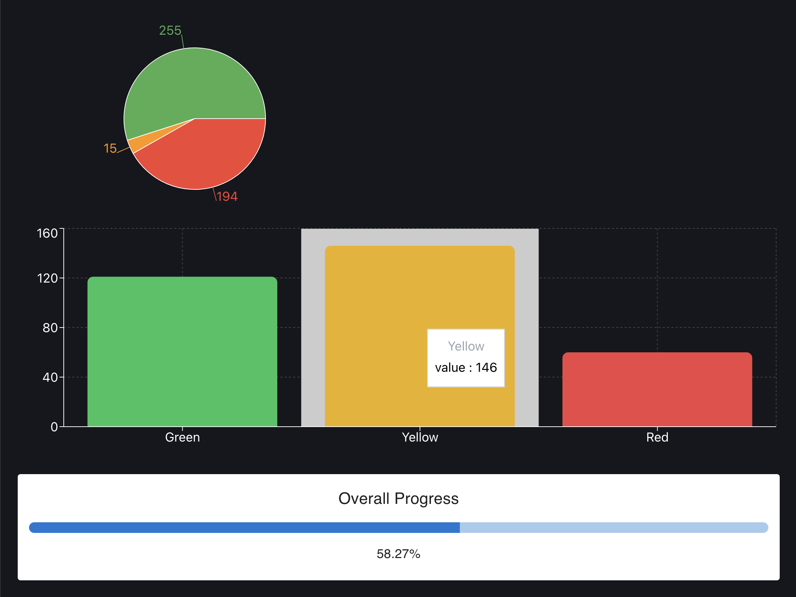
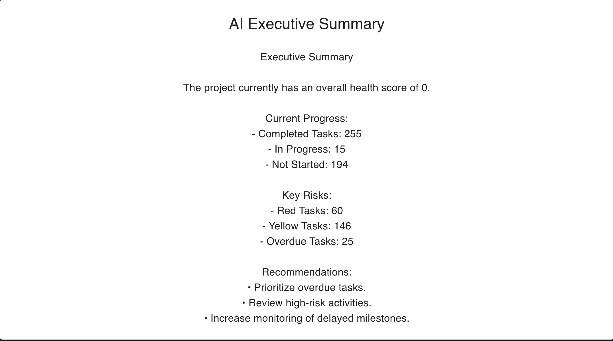
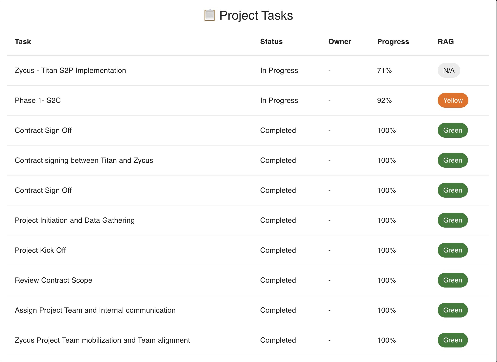
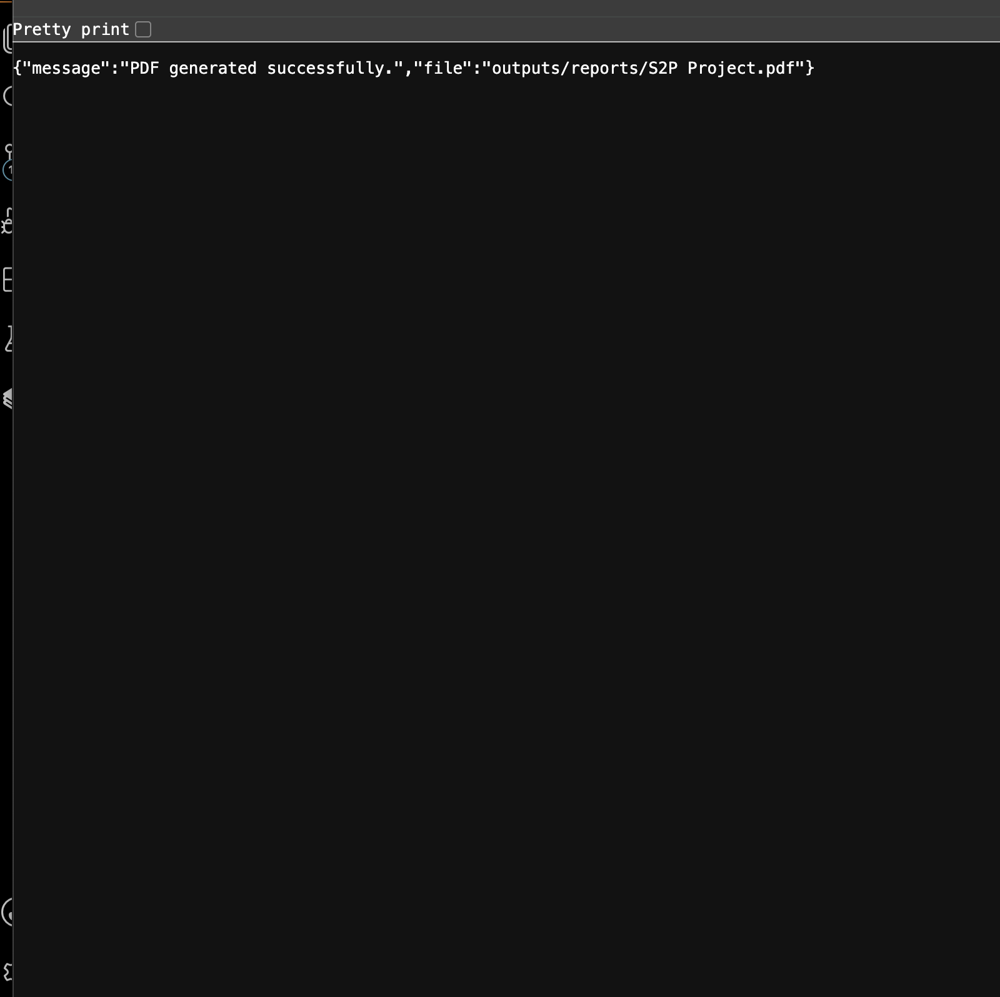
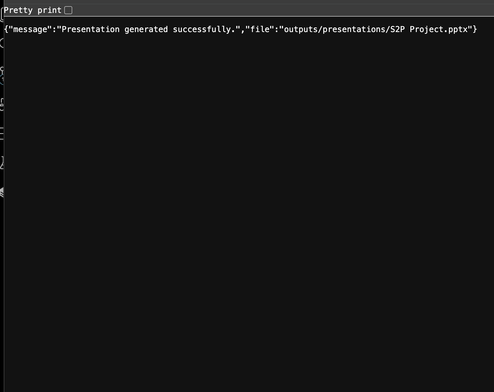

# 🚀 ProjectPulse AI

AI-powered Project Health Reporting Agent that analyzes project Excel workbooks and generates project health insights, executive summaries, PDF reports, and PowerPoint presentations.

Built as part of the Zycus AI Engineer evaluation.

---

# 📌 Features

## Project Analysis
- Upload project Excel files (.xlsx)
- Automatically detect project sheets
- Extract tasks, owners, status, progress, and RAG indicators

## AI Project Insights
- Executive summary generation
- Risk identification
- Recommendations
- Project health assessment

## Dashboard
- KPI cards
- Project health score
- Progress visualization
- RAG analysis charts
- Task monitoring table

## Reports
- Generate PDF project reports
- Generate PowerPoint presentations

## Reliability
- Gemini AI integration
- Automatic local fallback summary when AI quota is unavailable

---

# 🛠 Tech Stack

## Backend

- Python
- FastAPI
- Pandas
- Pydantic
- Google Gemini API
- ReportLab
- python-pptx

## Frontend

- React
- Vite
- Material UI
- Recharts
- Axios

---

# 📂 Project Structures

```
ProjectPulse-AI/
│
├── backend/
│   ├── app/
│   │   ├── api/
│   │   │   └── routes/
│   │   ├── extractors/
│   │   ├── health/
│   │   ├── reports/
│   │   ├── services/
│   │   ├── models/
│   │   └── main.py
│   │
│   ├── uploads/
│   ├── outputs/
│   ├── requirements.txt
│   └── .env.example
│
├── frontend/
│   ├── src/
│   │   ├── components/
│   │   ├── pages/
│   │   ├── services/
│   │   ├── App.jsx
│   │   └── main.jsx
│   │
│   ├── package.json
│   └── vite.config.js
│
├── sample_data/
│   └── S2P Project.xlsx
│
├── screenshots/
│   ├── dashboard.png
│   ├── kpi_cards.png
│   ├── charts.png
│   ├── pdf_report.png
│   └── presentation.png
│
├── docs/
│
├── README.md
├── LICENSE
└── .gitignore
```

# 📸 Screenshots

## Dashboard



## KPI Cards



## Project Summary



## Task Table



## PDF Report



## PowerPoint Presentation

